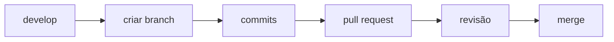

# Coude Jr — 2026

<div align="center">


[](https://github.com/coude-jr-26)
[](https://github.com/coude-jr-26/docs-engineering-handbook)
[](#)


</div>

<br>

> Bem-vindo à organização **Coude Jr 2026** no GitHub.
> Este espaço reúne os repositórios, padrões e fluxo de trabalho do time responsável pelo desenvolvimento do **CRM da Escola Coude**.

---

## Objetivo

Construir e evoluir um **CRM educacional** com foco em:

<table>
<tr>
<td width="50%" valign="top">

### Produto
- Gestão de contatos e funil
- Autenticação e permissões
- Organização de processos internos

</td>
<td width="50%" valign="top">

### Engenharia
- Qualidade técnica
- Colaboração em equipe
- Evolução contínua

</td>
</tr>
</table>

---

## Repositórios principais

<div align="center">

| Repositório | Descrição |
|:---|:---|
| **[crm-backend](https://github.com/coude-jr-26/crm-backend)** | API e regras de negócio |
| **[crm-frontend](https://github.com/coude-jr-26/crm-frontend)** | Interface web |
| **[crm-infra](https://github.com/coude-jr-26/crm-infra)** | Infraestrutura local: Docker Compose, Nginx, banco e cache |
| **[crm-shared-libs](https://github.com/coude-jr-26/crm-shared-libs)** | Bibliotecas compartilhadas |
| **[docs-engineering-handbook](https://github.com/coude-jr-26/docs-engineering-handbook)** | Documentação de engenharia, padrões e guias |
| **[.github](https://github.com/coude-jr-26/.github)** | Templates globais, padrões de issues/PRs, governança |

</div>

---

## Stack

<div align="center">

| Camada | Tecnologia |
|:--:|:--:|
| Backend |  |
| Frontend |  |
| Infra |  |
| Banco |  |
| Cache / Fila / Sessão |  |
| Gestão de tarefas |  |

</div>

---

## Fluxo de trabalho

<details>
<summary><strong>Clique para expandir o passo a passo</strong></summary>

<br>



1. **Criar branch** a partir de `develop`
2. **Nomear branch** com padrão, ex.: `feat/scrum-20-filtro-contatos`
3. **Fazer commits** com Conventional Commits
4. **Abrir pull request** para `develop`
5. **Passar por revisão** e ajustes
6. **Fazer merge** após aprovação

</details>

---

## Convenções de commit

**Padrão:**
```
tipo(escopo): descrição
```

<details>
<summary><strong>Ver exemplos de commits</strong></summary>

<br>

| Tipo | Exemplo |
|:--|:--|
| `feat` | `feat(auth): adiciona login com Google` |
| `fix` | `fix(api): corrige paginação de contatos` |
| `docs` | `docs(readme): atualiza instruções de setup` |
| `chore` | `chore(infra): adiciona docker-compose inicial` |

</details>

---

## Segurança e LGPD

> [!WARNING]
> Atenção redobrada com dados sensíveis.

- Nunca versionar segredos como `.env`, tokens, chaves e credenciais
- Nunca publicar dados reais de alunos ou candidatos
- Usar dados fictícios ou sanitizados em exemplos e evidências

---

## Como contribuir

- Consulte o repositório **docs-engineering-handbook**
- Use os **templates** de issue e pull request
- Mantenha pull requests **pequenos, claros e rastreáveis via Jira**

---

## Links úteis

<div align="center">

[](https://github.com/coude-jr-26)
[](https://github.com/coude-jr-26/docs-engineering-handbook)
[](#)

</div>

<div align="center">


**Time Coude Jr 2026.1**

</div>
